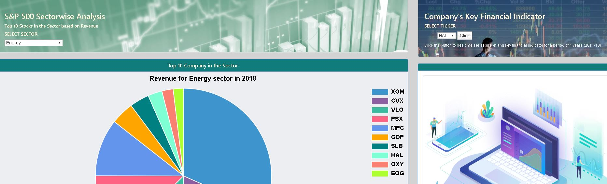

# Data-Visualization-Project

Data Visualization using Python Flask, HTML/CSS, JavaScript and Mongo Data Base to provide user an interactive dashboard with tables and charts that will help user explore the merged database of S&P 500 companies’ indices and their stock performance 

